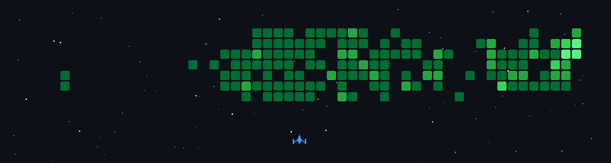

<!-- Awwwards-style Futuristic Header Banner -->

  

<!-- Live interactive statistics pill badges -->

  &nbsp;&nbsp;
  

  

# Hi there, I'm Chenul Dulmika Thenuwara! 👋

I am a passionate **Software Engineer** and **Full-Stack Developer** dedicated to building robust, scalable, and performance-driven digital solutions. I specialize in modern web ecosystems, cross-platform mobile development, and automated workflows.

  

## 🚀 About Me

- 🎓 **Education:** Final-year BSc (Honours) Software Engineering undergraduate at **NSBM Green University** (in association with **Plymouth University**) — graduating November 2026.
- 💼 **Current Role:** IT Intern at **Anunine Holdings Private Limited**.
- 🛠️ **Core Focus:** Building seamless user interfaces, developing optimized backend structures, and exploring self-hosted infrastructure.
- 🧠 **Tech Passions:** Beyond core software engineering, I am passionate about exploring emerging technologies, generative AI integration, DevOps pipelines, and workflow automation.

  

## 🍱 Interactive Bento Grid Dashboard

  <a href="https://github.com/Chenul-Thenuwara">
    <!-- Hover-active, animated, glassmorphic bento grid containing core concepts and technology loops -->
    
  </a>

  

## 🛠️ Tech Stack & Tools

| Category | Technologies |
| :--- | :--- |
| **Frontend Ecosystem** |        |
| **Backend & Databases** |     |
| **Cross-Platform** |   |
| **DevOps & Productivity** |     |

  

## ⚙️ Development Environment

- 🖥️ **OS/Environment:** Production-ready minimalist setup with a keen eye for workstation performance.
- 🎧 **Hardware Preferences:** High-polling-rate peripherals, clean mechanical interfaces, and high-fidelity studio layout monitoring.

  

## 📊 GitHub Statistics

  &nbsp;&nbsp;
  

  

  

## 🕹️ Cyber Space Shooter

  <!-- Interactive contribution graph rendered as a retro space invader game -->
  

  

## 🤝 Connect with Me

  &nbsp;&nbsp;
  

 

---

  Designed &amp; engineered with ❤️ by <a href="https://github.com/Chenul-Thenuwara">Chenul Thenuwara</a>.

