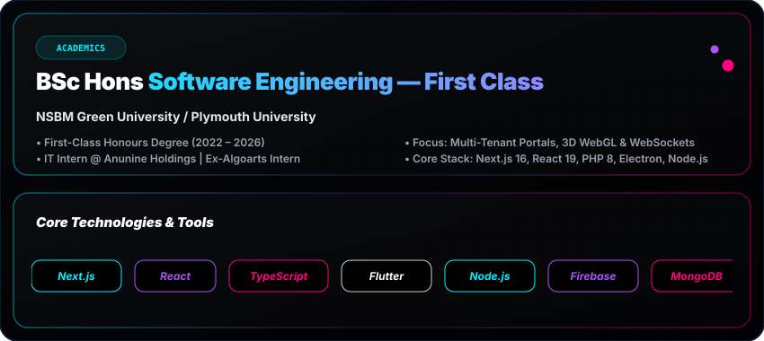
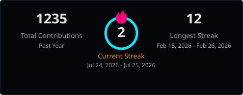
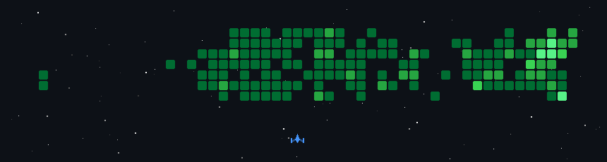

<!-- Awwwards-style Futuristic Header Banner -->

  

<!-- Live interactive statistics pill badges -->

  &nbsp;&nbsp;
  

  

# Hi there, I'm Chenul Dulmika Thenuwara! 👋

Full-Stack Software Engineer holding **First-Class Honours** with experience architecting multi-tenant enterprise portals, cross-platform ERP systems, desktop media servers, 3D WebGL platforms, and real-time WebSockets engines using **Next.js, React, TypeScript, Electron, PHP, Node.js, and Firebase**.

  

## 🚀 About Me

- 🎓 **Education:** **BSc (Hons) in Software Engineering – First Class Honours** from **NSBM Green University** (affiliated with **Plymouth University, UK**) (2022 – 2026).
- 💼 **Current Role:** Information Technology Intern at **Anunine Holdings** (Dehiwala, Sri Lanka).
- 💼 **Previous Role:** Full Stack Software Engineering Intern at **Algoarts** (Remote, Sri Lanka).
- 🛠️ **Core Focus:** Multi-tenant enterprise portals, 3D WebGL spatial rendering, desktop media servers, & real-time WebSockets engines.
- 🧠 **Tech Passions:** Generative AI integration, DevOps & CI/CD pipelines, workflow automation, and self-hosted infrastructure.

  

  <a href="https://github.com/Chenul-Thenuwara">
    <!-- Hover-active, animated, glassmorphic bento grid containing core concepts and technology loops -->
    
  </a>

  

## 💼 Work Experience

### 🏢 **Anunine Holdings** — *Information Technology Intern*
*Dehiwala, Sri Lanka | March 2026 – Present*
- **Multi-Tenant Enterprise Portal:** Architected a multi-tenant Enterprise IT Asset Management Portal in Next.js 16, React 19, and Firebase for 10 Strategic Business Units.
- **SLA Engine & Billing Automation:** Engineered a business-hours SLA engine in TypeScript (UTC+5:30) and automated IT billing reminders via Vercel Cron and Webhooks.
- **RBAC Security & Portals:** Implemented RBAC via Firebase Custom Claims across 5 portals (`/admin`, `/it`, `/hr`, `/sbu`, `/employee`) with digital asset handovers.
- **Corporate Systems:** Developed corporate web platforms (KSPA Accessories) in PHP 8 with custom socket SMTP engines (`fsockopen`) and CI/CD pipelines.

 

### 🏢 **Algoarts** — *Full Stack Software Engineering Intern*
*Remote, Sri Lanka | Aug 2025 – Feb 2026*
- **Ryzenor ERP System:** Architected Ryzenor ERP (Next.js 16, Electron 28, MongoDB) featuring high-speed POS, apparel matrix tracking, and Text.lk SMS dispatches.
- **Inventory & Analytics Workflows:** Engineered automated inventory reorder alerts, Purchase Order (PO) workflows, and interactive Recharts sales analytics dashboards.
- **Commercial Travel Platform:** Built a commercial travel platform in Next.js 16 featuring a 7-step custom tour wizard, MongoDB CMS, and JSON-LD Schema.org SEO.
- **Security & Authorization:** Implemented secure RESTful APIs, JWT authentication, and RBAC to protect application data streams across enterprise roles.

  

## 💻 Featured Projects

### 🎬 **Cineora – Self-Hosted Desktop Media Hub** *(2025 – 2026)*
> **Stack:** *Electron 28, React 19, Express 5, MongoDB, FFmpeg*
- Engineered a desktop streaming app managing multi-process background Express lifecycle execution.
- Built an HTTP 206 Partial Content video streaming controller with byte-range parsing and Node.js readable streams for low-latency seeking.
- Implemented an automated media scanner using FFprobe to extract 4K/HDR metadata and regex TV episode hierarchies (`SxxExx`).

---

### 📐 **3D/2D Spatial Interior Design Platform** *(2026)*
> **Stack:** *Next.js 16, React 19, Three.js, React Three Fiber (R3F), Firebase*
- Architected a web app enabling floor planning via 2D grid interfaces and real-time 3D WebGL spatial rendering.
- Implemented dynamic parametric 3D wall geometry calculations and 2D-to-3D coordinate vector conversion.
- Engineered an async 3D asset resolution pipeline streaming GLTF/GLB models from Firebase Storage.

---

### 🍿 **My Flix – Realtime Cinema Reservation System** *(2026)*
> **Stack:** *React 19, TypeScript, Socket.IO, Express, Docker*
- Engineered a real-time seat locking engine using Socket.IO WebSockets to prevent booking race conditions.
- Integrated PayHere payment gateway with MD5 signature verification and client-side PDF e-ticket generation.

  

## 🛠️ Tech Stack & Tools

| Category | Technologies |
| :--- | :--- |
| **Languages** |          |
| **Frontend & Desktop** |      |
| **Backend & Cloud** |      |
| **Tools & Infrastructure** |       |

  

## 🎓 Education & Certifications

- 🎓 **NSBM Green University** (Affiliated with Plymouth University, UK)
  - **BSc (Hons) in Software Engineering — First Class Honours** *(2022 – 2026)* | Colombo, Sri Lanka
- 📜 **SLIIT City University**
  - **Cisco Certified Network Associate (CCNA v7) — Merit** *(Dec 2022)* | Colombo, Sri Lanka
- 🏫 **D.S. Senanayake College**
  - **G.C.E. Advanced Level (Technology Stream)** *(Mar 2022 – Nov 2023)* | Colombo, Sri Lanka

  

## 🏛️ Leadership & Community

- 📢 **FOSS Community – NSBM Green University** | *Media Lead (Mar 2025 – Aug 2025)*
  - Drove a 40% increase in digital engagement across social platforms through technical content campaigns.
- 🌐 **FOSS Community – NSBM Green University** | *Council Member & Volunteer (Aug 2023 – Feb 2026)*
  - Co-organized national tech events including Software Freedom Day, Arduino Day, and Hacktonight.

  

## ⚙️ Development Environment

- 🖥️ **OS/Environment:** Production-ready minimalist setup with a keen eye for workstation performance.
- 🎧 **Hardware Preferences:** High-polling-rate peripherals, clean mechanical interfaces, and high-fidelity studio layout monitoring.

  

  &nbsp;&nbsp;
  

  

  

  <!-- Interactive contribution graph rendered as a retro space invader game -->
  

  

## 🤝 Connect with Me

  &nbsp;&nbsp;
  

 

---

  Designed &amp; engineered with ❤️ by <a href="https://github.com/Chenul-Thenuwara">Chenul Thenuwara</a>.

